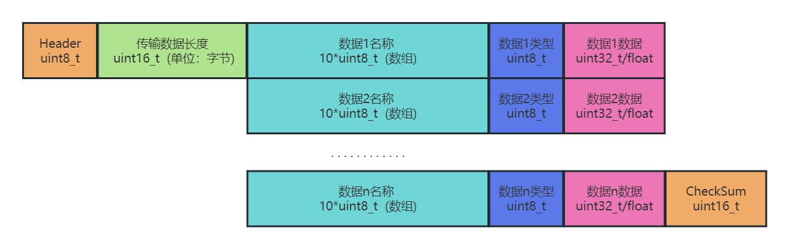

# 串口助手开发文档

## 文件结构
主程序：<br>
&emsp;&emsp;[SerialPortAssistant.py](#serialportassistant) 内含窗口布局及各种控件的功能函数<br>
辅助文件：<br>
&emsp;&emsp;[SerialPortAssistant_lib.py](#serialportassistant_lib) 内含串口助手数据处理方面的主要函数<br>
&emsp;&emsp;[Help_Windows.py](#Help_Windows) 一些辅助窗口<br>
&emsp;&emsp;[picture.py](#picture) 存储base64类型的图片，方便调用<br>
其他文件：<br>
&emsp;&emsp;usb_test.py <br>

## 传输协议
协议结构如下图所示：



每段数据可大致分为以下几个部分：帧头，数据部分，帧尾<br>
- 帧头：
    - Header<br>
        目前下位机发送的定为0x6A，上位机发送的定为0xA6<br>
    
    - Length<br>
        用于记录发送的数据段的长度，以字节为单位<br>

- 数据部分：

    数据部分由3个部分构成：数据名称，数据类型，数据内容<br>
    - 数据名称：可以发送10个字母以内的单词或5个字以内的汉字短语<br>
    - 数据类型：0代表int, 1代表float<br>
    - 数据内容：int或float类型的数据，为方便解码，都采用了32位的数据类型<br>

- 帧尾:

    帧尾为16位CRC校验码，用于检验数据传输过程中是否传输有误。<br>

## 文件内容
### SerialPortAssistant
- 常量定义
    ```python
    #Show_State 的选项
    DECODED_DATA = 0
    RAW_DATA_16 = 1
    RAW_DATA_2 = 2
    #Add_Timestamp 的选项
    ADD_TIMESTAMP = 0
    NO_TIMESTAMP = 1
    #Show_Image 的选项
    SHOW_IMAGE = 0
    NO_SHOW_IMAGE = 1
    #数据储存区的最大长度
    MAX_DATA_STORAGE_LENGTH = 500
    #采样点个数变化最小值
    MIN_SAMPLES_NUMBER_DELTA = 10
    ```

- 软件类
    ```python
    class SerialPortAssistant()
    ```

### SerialPortAssistant_lib
- 常量定义
    ```python
    UINT32_T = 0 #指代uint32类型的数据
    FLOAT = 1    #指代float类型的数据

    READ_FAILED = 0       #读取失败
    READ_SUCCESSFULLY = 1 #读取成功
    READ_CRC_ERROR = 2    #CRC校验失败
    READ_HEADER_ERROR = 3 #header校验失败

    SEND_FAILED = 0       #发送失败
    SEND_SUCCESSFULLY = 1 #发送成功

    WORD_COUNT = 10 #数据名称的字节数

    # CRC16校验表
    W_CRC_TABLE = [...]
    ```

- 函数功能
    1. 用于获取软件路径
        ```Python
        # out: [str] 软件路径
        def App_path():
        ```
    1. 用于创建文件夹目录
        ```Python
        # in : 文件夹目录路径
        def mkdir(path):
        ```
    1. 用于解析浮点数据
        ```Python
        # in : [bytes]原始的二进制数据
        # out: [float]解析出来的浮点数据
        def BinaryToFloat(raw_binary_data):
        ```
    1. 用于解析utf-8编码的字符串
        ```Python
        # in : [bytes]原始的二进制数据（连续的）
        # out: [str]解析出来的对应utf-8编码的字符串
        def BinaryArrayToName(binary_array: bytes):
        ```
- 类功能
    1. 用于对波形图进行一些操作，整合了一个用于绘制2维图像的类
        ```Python
        class RealTimePlot_2D:
        ```
        - 属性
            ```Python
            self.ax #[object]用于绘制图像的轴
            self.x  #[list]数据的x坐标
            self.y  #[list]数据的y坐标
            self.title #[str]数据图像的标题
            self.x_label #[str]x坐标的标签
            self.y_label #[str]y坐标的标签
            ```
        - 方法
            1. 更新波形图像
                ```Python
                def update_plot(self):
                ```
    1. 串口通信的相关操作，整合成一个类
        ```Python
        class Serial_Data_Read():
        ```
        - 属性
            ```Python
            self.ser #串口设备对象
            self.read_is_done #[bool]是否完成读取
            self.port_name #[str]串口名
            self.baud_rate #[int]波特率
            self.byte_size #[int]字节大小
            self.received_data #[dict]接收到的数据，以字典形式储存
            self.received_header #[str]设定接收时对应的帧头，确保是发送给电脑的数据。目前设为 '6A'
            self.received_data_update #[bool]接收到的数据是否更新过
            self.received_raw_data #[list]接收到的原始二进制数据
            self.send_data #[dict]要发送的数据
            self.send_header #[str]发送数据的帧头，和单片机上的设定值对应。目前设为 'A6'
            self.send_data_update #[bool]发送的数据是否更新
            self.send_raw_data #[list]发送的原始数据
            ```
        - 方法
            1. 类初始化
                ```Python
                def __init__(self):
                ```
            1. 打开串口
                ```Python
                #out: [bool]若成功打开则返回True，若无可用端口或打开失败则返回False
                def OpenSerialPort(self):
                ```
            1. 关闭串口
                ```Python
                #out: [bool]若成功关闭则返回True，若关闭失败则返回False
                def CloseSerialPort(self):
                ```
            1. 读取数据
                ```Python
                #out: [int]数据读取情况
                def ReadData(self):
                ```
            1. 发送数据
                ```Python
                #out: [int]是否发送成功
                def SendData(self):
                ```
            1. CRC校验
                ```Python
                #in : [list/bytes]原始二进制数据
                #in : [dict]接收到的数据解码后的数据字典
                #out: [bool]CRC校验是否正确
                def VarifyCRC(self,received_raw_data_list,received_data):
                ```
            1. 计算CRC校验码
                ```Python
                #in : [list/bytes]原始二进制数据
                #out: [int]计算得到的CRC校验码
                def GetCRC_16(self,raw_data_list):
                ```
            1. 给发送数据添加CRC校验码
                ```Python
                def AppendCRC(self):
                ```
            1. 检测串口是否打开
                ```Python
                def PortIsOpen(self):
                ```


### Help_Windows


### picture


```python
    
```